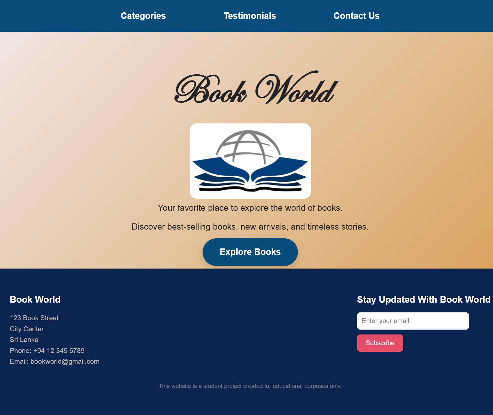
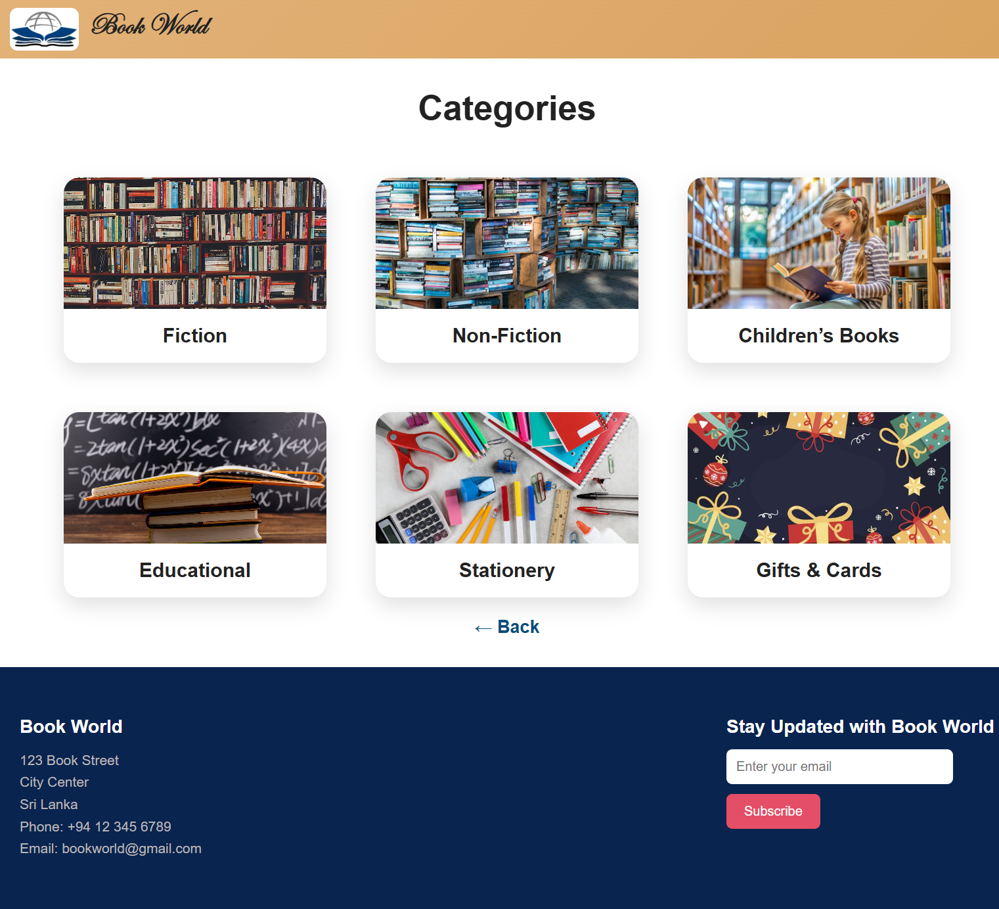
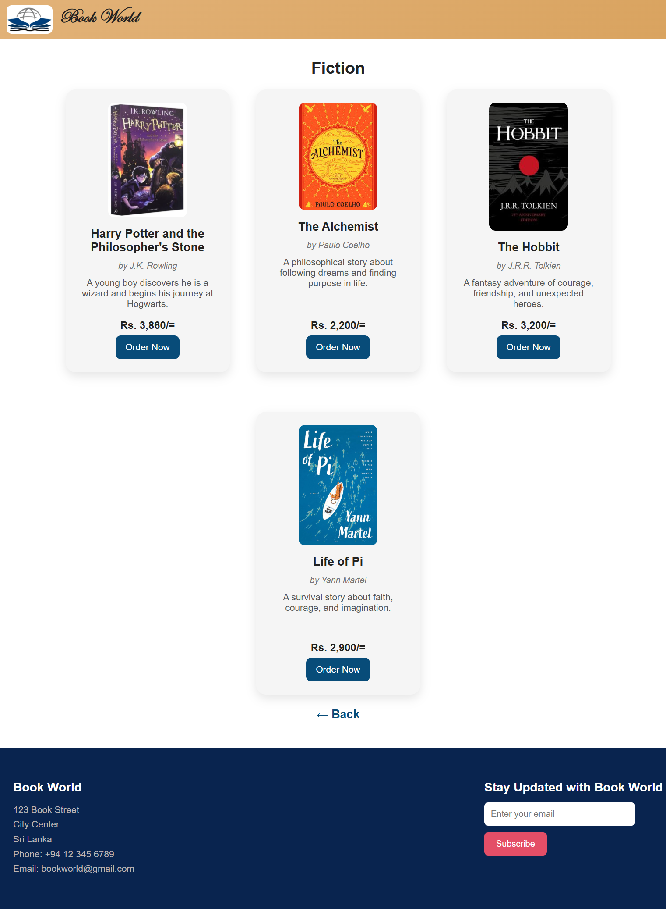
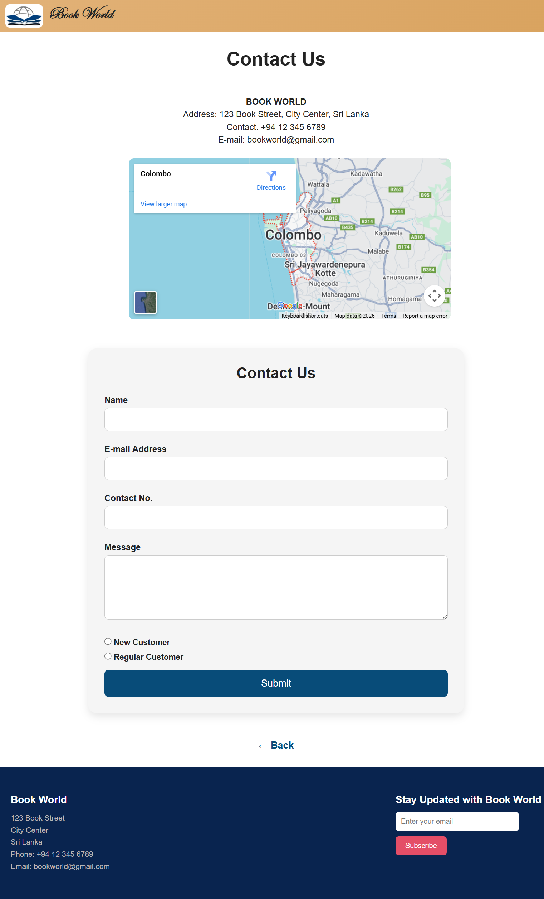

# Book World – Book Shop Website

This is a frontend Book Shop website developed as a student project using **HTML** and **CSS**.

---

## 🌟 Features
- Home page
- Explore Books page
- Categories page
- Fiction page
- Non-Fiction page
- Educational Books page
- Children’s Books page
- Stationery page
- Gifts & Cards page
- Customer Testimonials page
- Contact Us page with form
- Responsive navigation bar
- Clean UI design

---

## 🛠 Technologies Used
- HTML5
- CSS3
- Responsive Design

---

## 📌 Project Status
This project is currently implemented as a **static frontend website**.  
Backend features such as login, admin panel, and database integration are planned for future versions.

**Student Project – Educational Purpose Only**

---

## 📸 Screenshots
- 
- 
- 
- 

---

## 👤 Author
- **Name:** Thakshila  
- **GitHub:** [https://thakshi17.github.io/book-world-website/](https://thakshi17.github.io/book-world-website/)

---

⭐ Feel free to explore and provide feedback!
