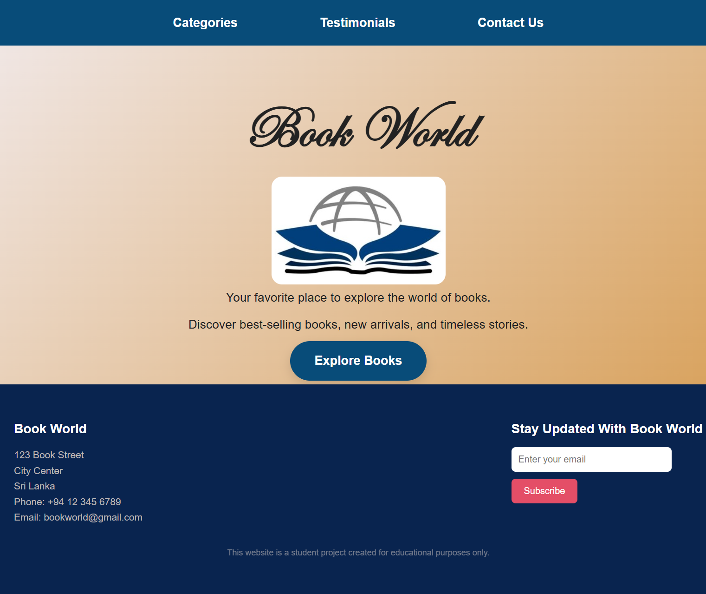
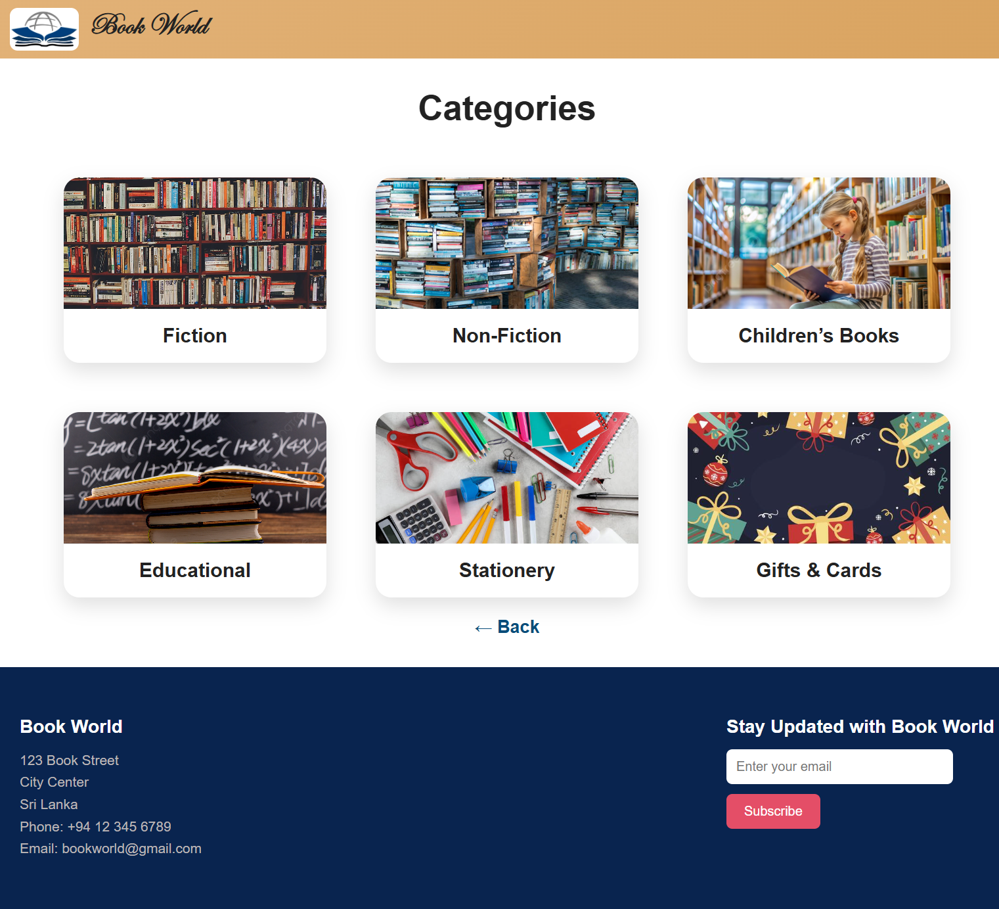
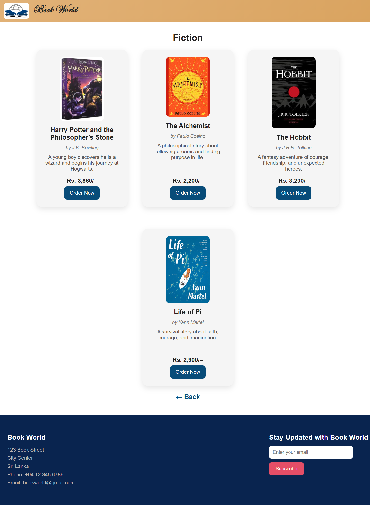
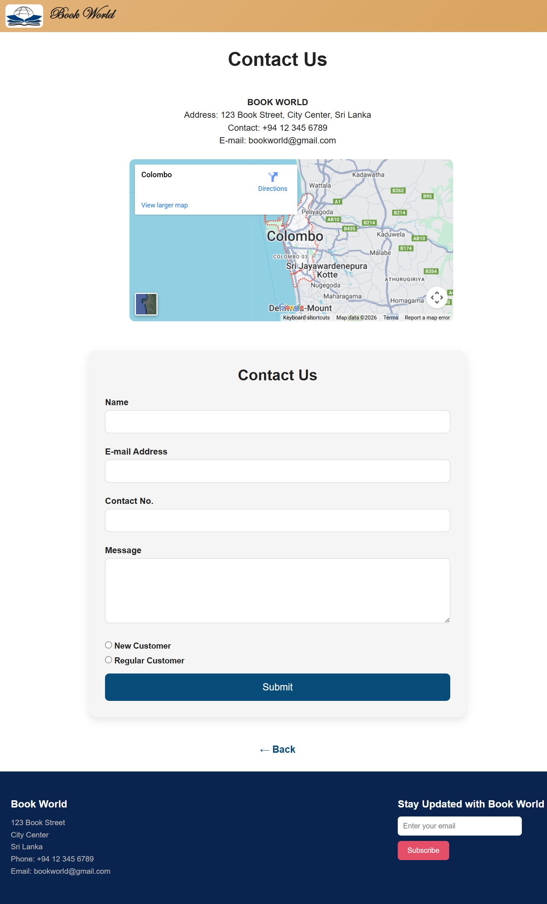

# Book World – Book Shop Website

This is a frontend Book Shop website developed as a student project using **HTML** and **CSS**.

---

## 🌟 Features
- Home page (index.html)
- Explore Books page (Best Selling Books of the Month, New Arrivals, etc.)
- Categories page 
- Fiction page
- Non-Fiction page
- Educational Books page
- Children’s Books page
- Stationery page
- Gifts & Cards page
- Customer Testimonials page
- Contact Us page with form
- Fixed Header and Footer for Better Navigation
- Responsive Design (Mobile & Desktop Friendly)
- Clean UI Design

---

## 🛠 Technologies Used
- HTML5
- CSS3

---

## 📌 Project Status
This project is currently implemented as a **static frontend website**.  
Backend features such as login, admin panel, and database integration are planned for future versions.

**Student Project – Educational Purpose Only**

---

## 📸 Screenshots

---

## 👤 Author
- **Name:** Thakshila Maduwanthi
## 🔗 Links
- Live Demo: [Book World Website](https://thakshila17.github.io/book-world-website/)
- Source Code: [GitHub Repository](https://github.com/Thakshila17/book-world-website)
  
---

⭐ Feel free to explore and provide feedback!
